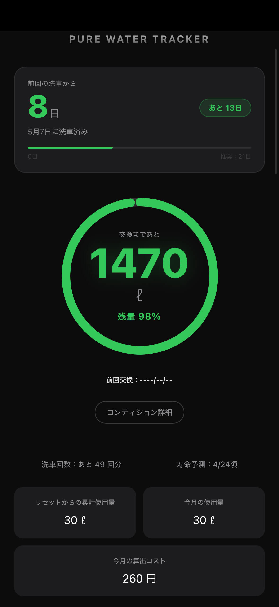
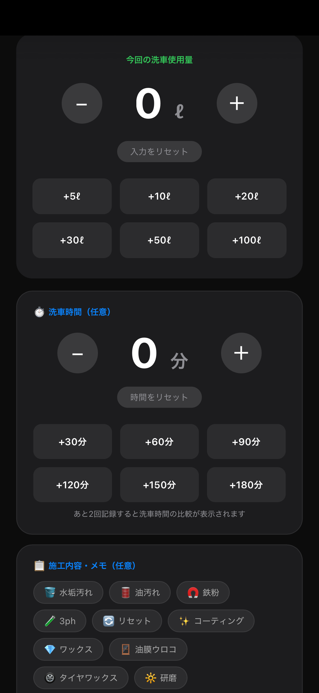
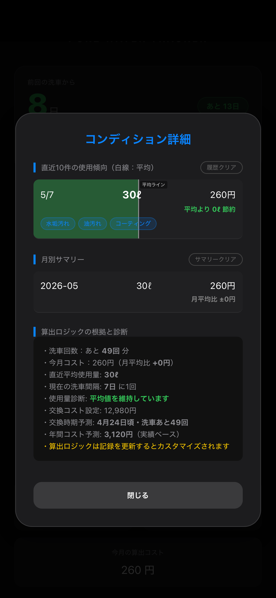
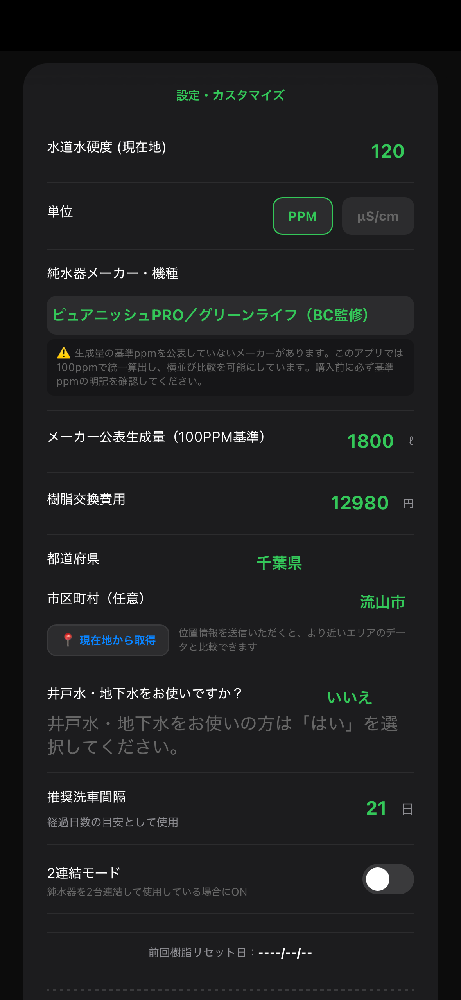

# Pure Water Tracker (General Edition)

**「メーカー公表値を超えて、純水器の『真の実力』を可視化する。」**

> **メーカー非依存の純水管理PWA**
> 使用量・TDS値から樹脂残量・寿命・コストを自動算出
> インストール不要・完全無料・アカウント登録なし

純水器の使用量・樹脂寿命・ランニングコストを記録／可視化するWebアプリです。
メーカー非依存で、樹脂量・TDS値・購入価格を自由に設定できます。
洗車ごとの実測データから、交換時期とコスパを現実ベースで把握できます。

> > 🎉 **公開2週間で444回クローン・83名にご利用いただいています（GitHub Insightsより）。**
> 純水ユーザーの皆様からの関心に、心から感謝いたします。

---

### 🔀 アプリを選ぶ

| 対象 | リンク |
|------|------|
| **ピュアニッシュ PRO / JUST をお使いの方** | 👉 [ピュアニッシュ専用版](https://missinglink4179.github.io/Pure-Water-Tracker/) |
| **他社製・カスタム純水器をお使いの方** | 👉 このページ（汎用版） |

---

## 📱 アプリ画面

<div align="center">
  
  
  
  
</div>

> 左から：**メイン画面**（残量・寿命をリアルタイム可視化）／**記録画面**（使用量・洗車時間をワンタップ入力）／**コンディション詳細**（履歴・コスト・交換時期を自動診断）／**設定画面**（メーカー・TDS・都道府県を入力）

---

## 🚀 今すぐ使う

**[Pure Water Tracker (General Edition) を開く](https://missinglink4179.github.io/pure-water-generic/)**

インストール不要・完全無料・スマホのブラウザだけで動作します。

### ⚡ Quick Start（3ステップ）

1. **アプリを開く** — 上記リンクをタップするだけ。アカウント登録不要。
2. **純水器の情報を入力** — メーカー・樹脂量・購入価格をカスタム入力。あらゆる機種・自作システムに対応。
3. **TDS値（水道水の硬度）を入力** — お住まいの地域のPPMを入力すると、残量・寿命・コストが自動算出されます。

> 💡 **ホーム画面に追加するとアプリのように使えます。**
> iPhoneの場合：Safariで開いて下部の「共有」→「ホーム画面に追加」
> Androidの場合：Chromeで開いてメニュー→「ホーム画面に追加」

---

## ✅ 主な機能

| 機能 | 内容 |
|------|------|
| 樹脂残量リアルタイム表示 | 使用量とTDS値から残量・残量%をリング表示 |
| 純水使用量記録 | 洗車ごとの使用量をワンタップで入力・保存 |
| 洗車時間記録 | 施工時間を記録し、平均との比較が可能 |
| 樹脂寿命予測 | 過去の使用傾向から交換時期を自動予測 |
| 月別コスト集計 | 月ごとの使用量・算出コストをサマリー表示 |
| コンディション診断 | 使用傾向・コスト・交換時期を総合診断 |
| カレンダー連携 | 洗車記録をApple・Googleカレンダーに追加 |
| メーカー横断比較 | あらゆる機種・自作システムに対応したカスタム設定 |

---

## ✨ 特徴

- **自由なカスタム設定**: 樹脂量やTDS値を入力することで、あらゆるメーカー品に対応。
- **自作派の方にこそ使ってほしい**: コストコのカートリッジ流用・大型タンク自作など、市販品の枠を超えた純水システムの「真の実力」を測るのに最適です。
- **データ駆動型の管理**: 独自の計算ロジックにより、現在の樹脂効率をリアルタイムで算出。
- **匿名データの集約と還元**: 収集するのは純水関連データのみ。個人情報は一切取得しません。集まったデータは比較情報として皆様にフィードバックします。

---

## 🧮 算出ロジックについて

本アプリの数値は以下の考え方で算出しています。

**入力値**
- 水道水硬度（TDS / PPM）
- 洗車ごとの純水使用量（ℓ）
- メーカー公表生成量（100PPM基準）
- 樹脂交換費用

**残量の計算**

メーカー公表生成量（100PPM基準）をユーザーのTDS値で換算し、最大生成可能量を算出します。

```
最大生成可能量（ℓ）= メーカー公表生成量 × 100 ÷ TDS値
残量（ℓ）= 最大生成可能量 − 累計使用量
```

**寿命予測**

直近の洗車ごとの平均使用量と、過去の洗車間隔（日数）をもとに交換時期を予測します。

**注意事項**

これらはすべて理論値に基づく目安です。実際の純水質・水温・使用状況により誤差が生じます。正確な樹脂寿命はTDSメーターでご確認ください。

---

## 🤝 データ提供のお願い

本アプリには、樹脂交換時に**匿名で実測データを送信する機能**が搭載されています。

**収集するデータ：** TDS値・使用量・メーカー・都道府県・井戸水の有無など、純水に関する数値のみ。
**収集しないデータ：** お名前・住所・メールアドレスなど、個人を特定できる情報は一切取得しません。
**保存先：** Google スプレッドシート（Google Apps Script経由で匿名集計）
**活用方法：** 機種別・地域別の樹脂効率比較として、ユーザーの皆様に還元予定です。

> 📊 **あなたのデータが、業界の透明化に繋がります。**

---

## 🌟 開発コンセプト：純水器業界の透明化を目指して

純水器業界では、製品ごとの生成量や寿命の**基準が統一されておらず、ユーザーが横断的に比較することが難しい現状**があります。

- **統一基準のない公表データへの疑問**: 使用環境や測定条件が異なるため、カタログ値だけでは実態が掴めません。
- **樹脂の質と価格の相関性の可視化**: 樹脂効率など、質に見合った適正価格を明らかにしたい。
- **ユーザー主導による実測データの蓄積**: 実際に使ったユーザーの数値を集約し、業界全体の透明化に繋げる。

---

## 🛠 Built With

- HTML / CSS / JavaScript
- PWA（Progressive Web App）
- LocalStorage（端末内データ保存）
- Google Apps Script（匿名統計データ収集）
- GitHub Pages（ホスティング）

---

## 👨‍💻 開発者向け情報

ローカルで確認する場合はリポジトリをクローンして index.html をブラウザで開くだけで動作します。サーバー・ビルド不要です。

**ディレクトリ構成**

```
pure-water-generic/
├── index.html        # アプリ本体（単一ファイル）
├── admin.html        # 管理画面
├── screenshots/      # README用スクリーンショット
└── README.md
```

**今後の予定**
- [ ] 機種別・地域別 樹脂効率ランキング公開
- [ ] 蓄積データのユーザーへの還元・可視化
- [ ] コミュニティ比較機能

フィードバック・バグ報告は [Issues](https://github.com/missinglink4179/pure-water-generic/issues) からお気軽にどうぞ。

---

## ⚠️ 免責事項

- 本アプリは個人開発のツールです。
- 数値は算出理論値に基づく目安であり、正確性や樹脂の寿命を保証するものではありません。
- 本アプリの利用により生じたトラブルや損失・損害について、開発者は一切の責任を負いません。
- 無断転載・再配布、および商用利用を固く禁じます。

---

### 🔍 検索キーワード (SEO)

洗車 純水 管理 / 純水器 寿命 計算 / 純水生成量 実測 / TDS測定 記録 / イオン交換樹脂 コスパ / 自作純水器 計算 / 洗車 メンテナンス アプリ / 純水器 比較 / 洗車 純水 コスパ / ピュアニッシュJUST 寿命 / 純水器 ランキング

---

⭐️ このプロジェクトに賛同いただける方は、ぜひ **Star** をお願いします！
